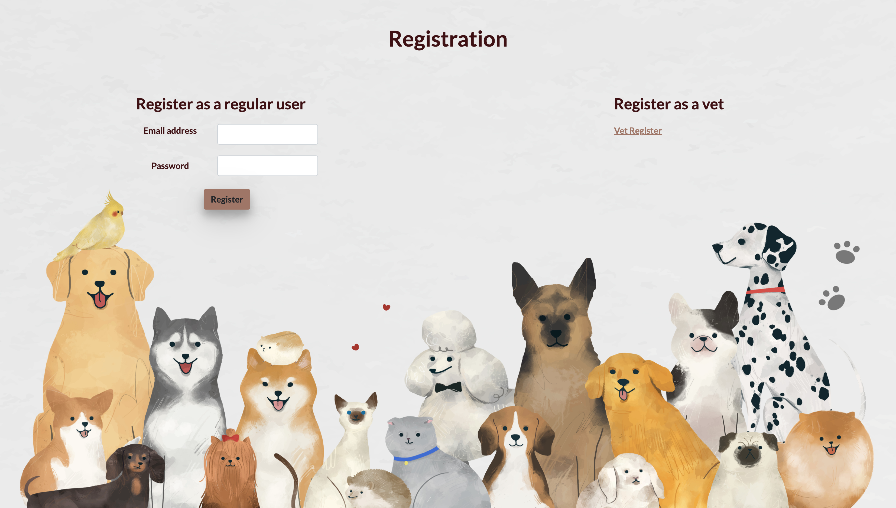
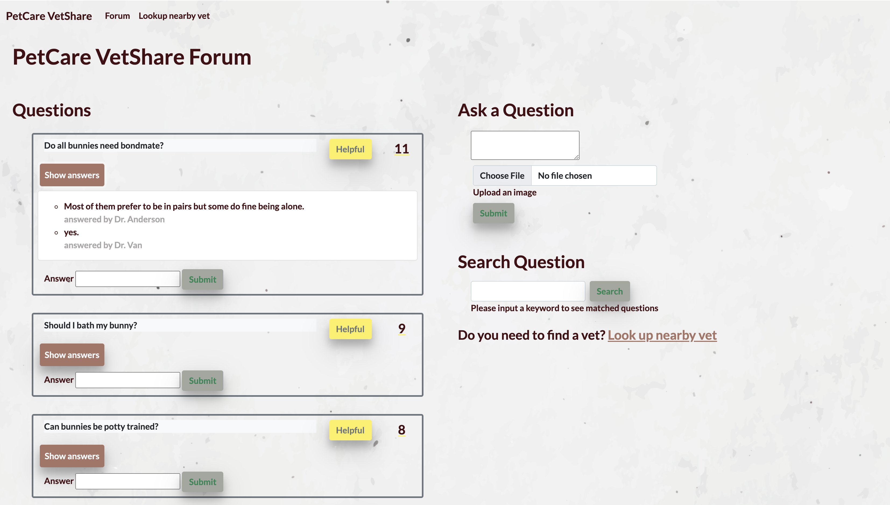
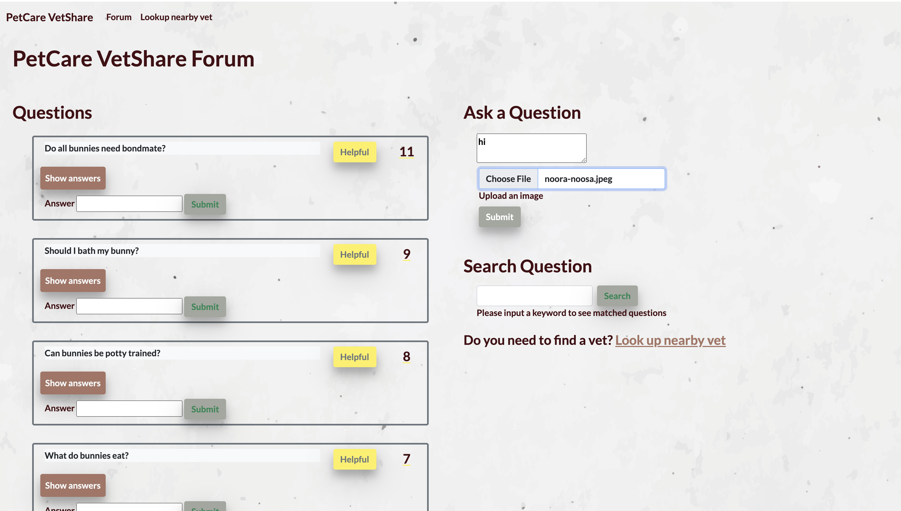
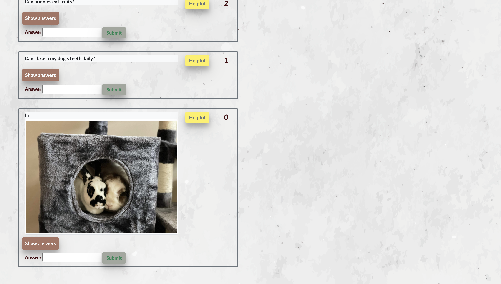
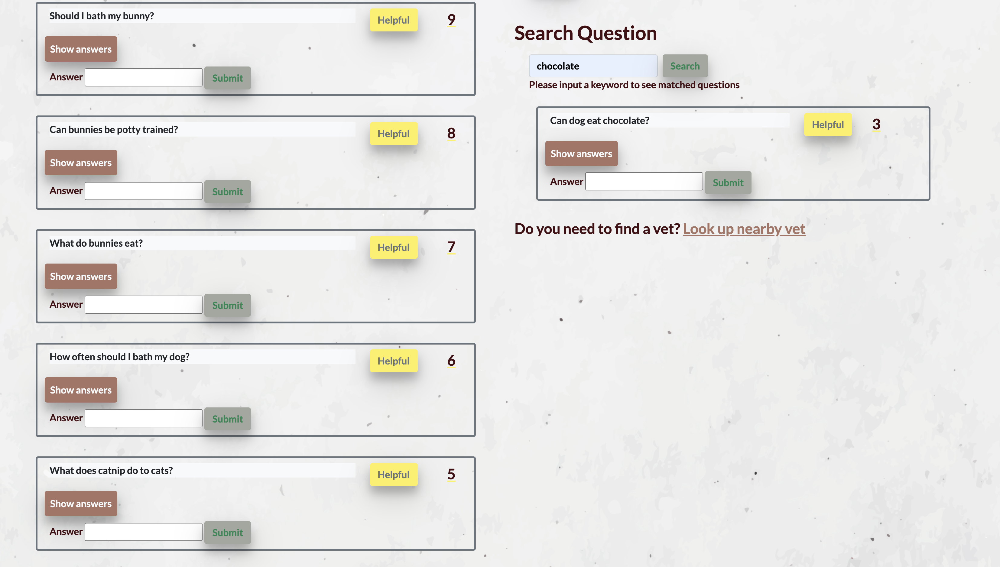
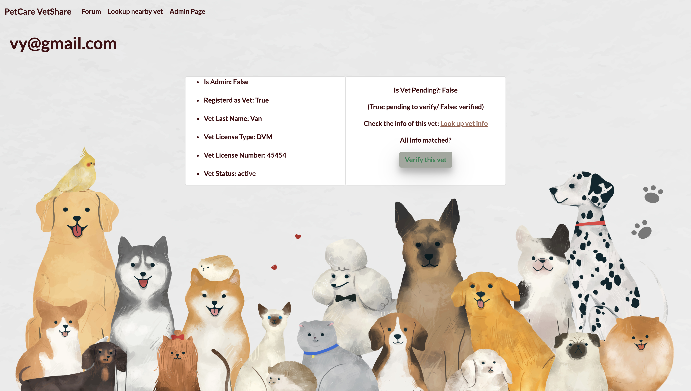

# PetCare VetShare 

## Summary 
**PetCare VetShare** is an user interactive forum, providing pet owners a platform to ask questions about their pets and get answers from verified veterinary professionals. Pet Care Vet Share forum is created as a space to facilitate conversations between pet owners and veterinary professionals with the goal of spreading awareness and knowledge regarding appropriate pet care. 

## Technologies

**Tech Stack:**

- Python
- Flask
- SQLAlchemy
- Jinja2
- HTML
- CSS
- Javascript
- JQuery
- AJAX
- Bootstrap
- Python unittest module
- Google Maps API
- Cloudinary API

## Features

Users can log in with their email and password

Users can register as regular users or vets 

Users can see all of the questions and vote a question helpful; questions are displayed in the descending order of votes.

Users can ask a question, attach an image file along and submit to have it displayed on the forum 

Users can put a keyword in the search bar and look up related questions 

Only verified vets can answer questions. Once registering as a vet, the status of vet users will be pending until an admin manually verify. An admin can see users info and use a third-party lookup tool to verify the vet info. 

Lastly, users can search for nearby vets based on their current location 
